# Some notes

## Notes

Một số lưu ý mà mình rút ra được khi làm bài này. Xem xét chủ yếu là ở bảng Quotes, vì bảng này mình sẽ sinh ra nhiều dòng / bảng ghi dữ liệu, ngoài ra thì bảng này không có nhiều cột (thuộc tính), có thể xem thêm về các thuộc tính ở trong `database/scripts/init.sql`.

1. Với 50k records thì thì vẫn có thể thực hiện truy vấn trong bảng `Quotes` như khi chỉ mới có 10-100 records, sự khác biệt là không quá lớn.
2. Sau khi đã thử với `Quotes` (khoảng hơn 1 triệu dòng dữ liệu) thì mình thấy là sự khác biệt lớn nhất là nằm ở `SELECT COUNT`. Còn các câu truy vấn `SELECT`, `INSERT INTO` hay `UPDATE` thì hiệu năng vẫn ở mức tốt.
3. Mỗi dòng / bảng ghi dữ liệu trong `Quotes` sẽ chiếm khoảng `235.1853` bytes dữ liệu. Vậy với 1 triệu dòng / bảng ghi, thì mình có tổng dung lượng là: 235.1853 * 1000000 = 235185300 Bytes ~ 229673.144 KB ~224.3 MB, đây cũng không phải là một con số nhỏ.

<figure align="center">
  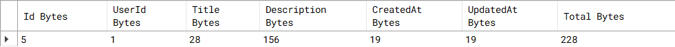
  <figcaption>Bytes của từng dòng và tổng bytes của một bảng ghi..</figcaption>
</figure>

<figure align="center">
  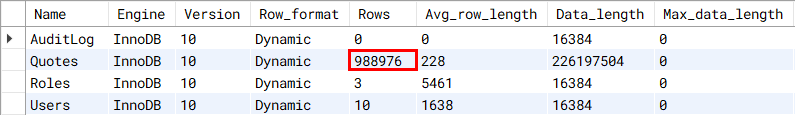
  <figcaption>Tổng bytes của toàn bảng (toàn bộ bảng ghi).</figcaption>
</figure>

4. Trong quy vấn COUNT, mình có thử check performance với Profiling thì nhận thấy là khi dữ liệu càng nhiều thì nó COUNT càng lâu (cái này cũng dễ hiểu), từ đây tạo ra một vấn đề (PROBLEM 1). Cùng xem các ảnh bên dưới:

<figure align="center">
  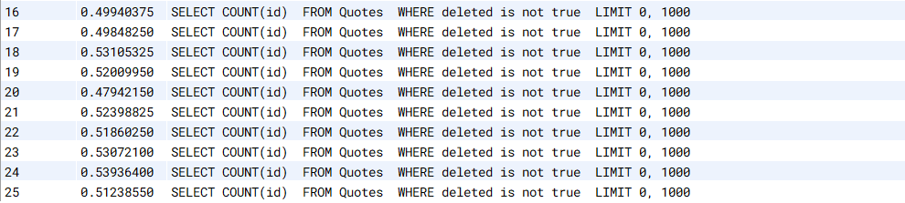
  <figcaption>Kiểm tra hiệu năng của SELECT COUNT qua 10 lần thử.</figcaption>
</figure>

<figure align="center">
  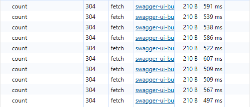
  <figcaption>Kiểu tra hiệu năng của yêu cầu đếm Quotes qua 10 lần thử.</figcaption>
</figure>

5. Bảng dùng InnoDB và MYISAM sẽ có một chút khác biệt. InnoDB sẽ không lưu đúng số dòng thực tế, có thể so sánh kết quả giữa `COUNT(*)` và SHOW TABLE STATUS. Vì InnoDB được tạo ra để đảm bảo về Data Consistency với Transaction, nên nó sẽ cần phải tối ưu hiệu năng cho Transaction => mà để cập nhật Metadata thì sau mỗi INSERT, DELETE thì sẽ cần phải cập nhật lại thông tin chính xác, để tránh bottleneck, bad performance thì họ chỉ ƯỚC LƯỢNG thôi. Chì vì thế mà khi COUNT(\*) thì InnoDB sẽ đếm từng dòng 1 hoặc scan index. Nhìn thêm ảnh dưới để nhận thấy sự khác biệt.

<figure align="center">
  
  <figcaption>Xem trạng thái của nhiều bảng, trong đó Rows của Quotes chỉ là con số ước lượng.</figcaption>
</figure>

<figure align="center">
  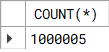
  <figcaption>Đếm số dòng / bảng ghi thực tế với COUNT(*)</figcaption>
</figure>

6. Dù SELECT COUNT (*) chậm là thế, nhưng khi truy vấn một dòng dữ liệu cụ thể nào đó thì vẫn cho ra hiệu năng rất tốt. Kết quả tương tự khi mình truy vấn nhiều bảng ghi (10 bảng ghi).

<figure align="center">
  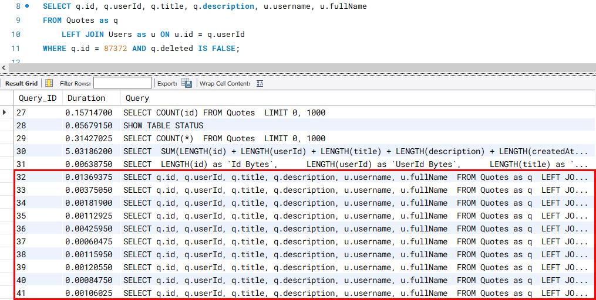
  <figcaption>Kiểm tra hiệu năng truy vấn một bảng ghi cụ thể với 10 lần thử.</figcaption>
</figure>

<figure align="center">
  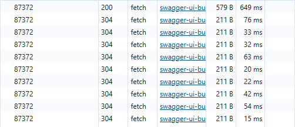
  <figcaption>Kiểm tra hiệu năng yêu cầu 1 bảng ghi cụ thể với 10 lần thử.</figcaption>
</figure>

<figure align="center">
  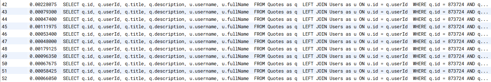
  <figcaption>Kiểm tra hiệu năng truy vấn một bảng ghi cụ thể với 10 lần thử, với ID xa hơn.</figcaption>
</figure>

<figure align="center">
  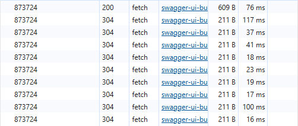
  <figcaption>Kiểm tra hiệu năng yêu cầu 1 bảng ghi cụ thể với 10 lần thử, với ID xa hơn.</figcaption>
</figure>

<figure align="center">
  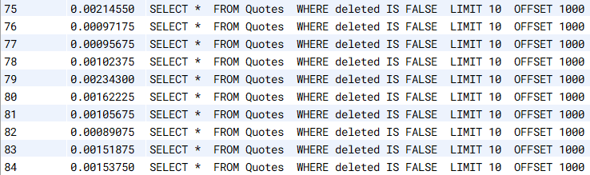
  <figcaption>Kiểm tra hiệu năng truy vấn nhiều bảng ghi với 10 lần thử.</figcaption>
</figure>

<figure align="center">
  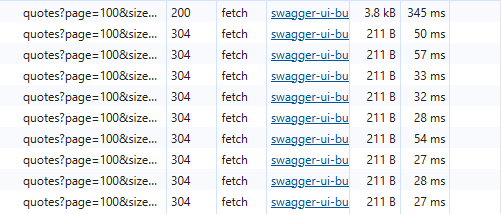
  <figcaption>Kiểm tra hiệu năng yêu cầu lấy nhiều bảng ghi với 10 lần thử.</figcaption>
</figure>

7. Mình phát hiện ra một điều thú vị là ứng dụng của mình có thể chịu được 100 người dùng đồng thời trong vòng 1 giây. Nhưng 1000 users thì không chịu được. Nên mình có thử dùng cache, thì kết quả là nó xuất xắc chịu được 1000 người dùng đồng thời trong 1 giây, vấn đề này tạm thời có thể giải quyết được. Nhưng còn vấn đề (PROBLEM 3) thì vẫn chưa.

## Problems

- PROBLEM 1: với những nghiệp vụ mà yêu cầu đếm số các bảng ghi ở trong bảng, thì việc mà mình truy vấn `SELECT COUNT` là một điều không nên, vì nó sẽ làm chậm đi tổng thời gian xử lý yêu cầu từ Client. Và từ đây cũng sinh ra thêm một vấn đề nữa (PROBLEM 2).
- PROBLEM 2: để giải quyết PROBLEM 1 thì mình có thể dùng Redis để lưu lại thông tin này, nhưng vấn đề ở đây là mình sẽ cần phải luôn đồng bộ được số đến trong Redis với số đến thực tế mà bảng có... Có thể dùng cronjob để query 1 phút / lần và cập nhật lại vào trong redis ? Một khi insert thì cập nhập số đếm trong Redis ? Tạo thêm một table cho biến đếm và trigger cập nhật table đó ? Nhìn chung thì những cách này nó vẫn gây ra vấn đề không đồng nhất dữ liệu.
- PROBLEM 3: mặc dù chuyển toàn bộ request sang Redis và có thể phục vụ cho 1000 người dùng đồng thời, nhưng khi lên 10k, 100k thì chưa biết. Và vấn đề về Database Connection Limitation vẫn chưa giải quyết được. Cụ thể là trong app mình setup là có tối đa 10 kết nối tới database, nhưng liệu khi có 100 kết nối thì có chịu được không ??? Vấn đề này mình có thể giải quyết bằng việc bỏ các request vào trong Queue rồi xử lý từng cái, tuy nhiên thì có thể làm tăng thời gian phản hồi cho những người dùng request sau, nghĩa là người dùng thứ 1000 sẽ lâu hơn rất nhiều khi so với người dùng đầu tiên.